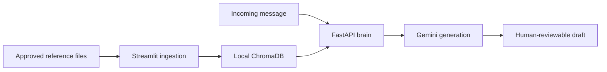

# Pratirupa / AI-Twin

Pratirupa is a consent-based persona-memory and communication-drafting prototype. It ingests reference material into ChromaDB, retrieves relevant context, and asks Gemini to prepare a style-matched draft for human review.

> Use only material you own or have permission to process. Generated drafts should remain reviewable and clearly attributable to the real sender.

## Included Components

- `Mohini/app.py` — Streamlit interface for ingesting documents and persona preferences
- `Mohini/ingestion_utils.py` — text extraction, cleaning, chunking, and embeddings
- `Mohini/brain_api.py` — FastAPI retrieval and draft-generation service
- `Mohini/gmail_listener.py` — optional email polling and reply workflow
- `Mohini/vapi_server.py` — chat-completions-style API adapter
- `Mohini/voice_ui.py` — experimental voice interface

The earlier README referenced a Simli/Next.js client that is not present in the current repository, so those setup instructions have been removed.

## Architecture



## Setup

```bash
git clone https://github.com/Leadyhere/AI-Twin.git
cd AI-Twin/Mohini
python -m venv .venv
source .venv/bin/activate
pip install -r requirements.txt
cp .env.example .env
```

On Windows, activate the environment with `.venv\Scripts\activate`.

## Run the Components

```bash
# Ingestion UI
streamlit run app.py

# Draft-generation API
uvicorn brain_api:app --reload

# Optional email listener
python gmail_listener.py
```

Automatic email sending is disabled by default in the professionalization branch. Enable it only in a controlled test account after reviewing the privacy and failure implications.

## Configuration

| Variable | Purpose |
|---|---|
| `GOOGLE_API_KEY` | Gemini API key |
| `GENERATION_MODEL` | Generation model identifier |
| `PERSON_NAME` | Persona identifier used for retrieval |
| `GMAIL_EMAIL` | Optional test Gmail account |
| `GMAIL_APP_PASSWORD` | Optional app password for the test account |
| `BRAIN_API_URL` | URL of the local brain API |
| `AUTO_SEND_ENABLED` | Explicit opt-in for automatic sending; defaults to `false` |

## Privacy and Safety

- Obtain permission before ingesting another person's messages or documents.
- Keep `.env`, ChromaDB data, credentials, and exported communications out of Git.
- Use draft-only operation by default.
- Do not use model-reported confidence as the only authorization for external actions.
- Avoid logging email bodies or other private message content.

## Roadmap

- Replace app passwords with an OAuth-based email integration
- Add authentication and per-user data isolation
- Add deletion/export controls and a retention policy
- Validate structured model output with stronger schemas
- Add tests for parsing, retrieval filters, and draft approval

## License

No license has been selected yet.
